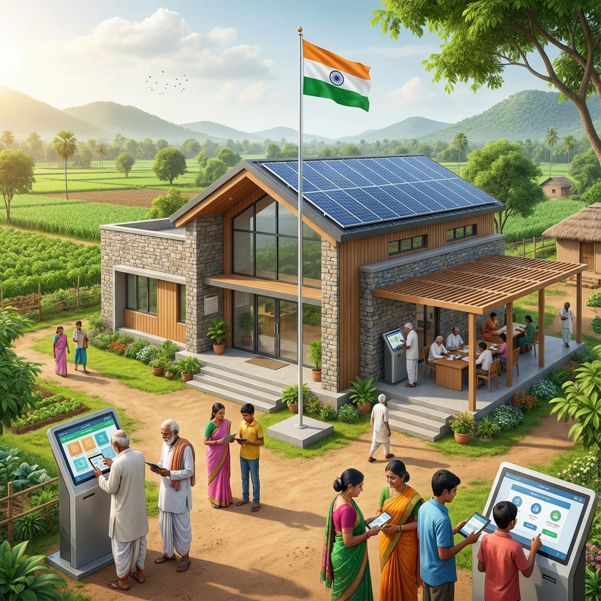

<div align="center">

  

  <h1>🏛️ Meri Panchayat (Public Issue Reporting Portal)</h1>
  
  <p>
    <strong>A Sovereign Digital Solution for Smarter, Transparent, and Accountable Rural Governance</strong>
  </p>

  <p>
    <a href="#-key-features">Features</a> •
    <a href="#%EF%B8%8F-tech-stack">Tech Stack</a> •
    <a href="#-getting-started">Getting Started</a> •
    <a href="#-admin-access">Admin Access</a> •
    <a href="#-multilingual-support">Multilingual</a>
  </p>

  <details>
    <summary>Project Stats & Badges</summary>
    <br>
    
    
    
    
    
  </details>

</div>

---
Live Website :-https://public-issue-reporting-portal.vercel.app/

## 📖 Overview

**Meri Panchayat** is a next-generation m-governance platform designed to bridge the gap between citizens and their local Gram Panchayat representatives. It provides a transparent, efficient, and user-friendly interface for reporting civic issues, tracking their resolution, and staying updated with government notices.

Aligned with the **Digital India** initiative and designed with **NIC-standard aesthetics**, this portal ensures maximum accountability and fosters community participation in local development.

---

## ✨ Key Features

### 👨‍👩‍👧‍👦 For Citizens
*   **Smart Issue Reporting**: Lodge complaints about **Water Supply, Drainage, Street Lights, Road Maintenance, and Garbage Collection** with location awareness and photo attachments.
*   **Real-time Tracking**: Dynamic progress tracker showing the journey from **Reported → Under Review → Resolved/Rejected**.
*   **OTP-Based Security**: Secure registration and login using Email-based OTP verification.
*   **Public Notice Board**: Stay updated with the latest circulars, schemes, and announcements from the Panchayat office.
*   **Animated Search**: High-performance expandable search bar to track any issue instantly via Tracking ID.

### 👮‍♂️ For Administrators (Panchayat Officials)
*   **Executive Dashboard**: Overview of all reported issues with categorization (Pending, Under Review, Resolved, Rejected).
*   **Digital Governance Workflow**: Officials can review reports, update status, and provide rejection reasons with full transparency.
*   **Notice Management**: Instant publishing and deletion of public notices with optional banner images.
*   **User Management**: Monitor verified citizens registered within the jurisdiction.

---

## 🌍 Multilingual Support

The portal is fully internationalized, allowing users to switch seamlessly between:
*   **English** (Global Standard)
*   **Kannada** (ಕನ್ನಡ - Localized for Karnataka Panchayats)

All system messages, flash notifications, labels, and notices support bidirectional translation via a centralized `translations.py` engine.

---

## 🛠️ Tech Stack

### Backend
*   **Core**: Python 3.x
*   **Framework**: Flask (WSGI Web Framework)
*   **Authentication**: Flask Session-based with Werkzeug security
*   **Email**: SMTP Integration for secure OTP delivery

### Frontend
*   **Structure**: Semantic HTML5
*   **Styling**: Vanilla CSS3 (Custom Design System with **Glassmorphism**, **Hero Sliders**, and **Premium Animations**)
*   **Typography**: Inter (Modern UI) & Playfair Display (Government Elegance)
*   **Icons**: Handcrafted SVG assets

### Database
*   **Engine**: SQLite3 (Lightweight, zero-configuration relational database)
*   **Schema**: Optimized for relational integrity between Users, Issues, and Notices.

---

## 🚀 Getting Started

### Prerequisites
*   Python 3.8 or higher
*   A modern web browser (Chrome, Firefox, Edge)

### Installation

1.  **Navigate to the project directory**:
    ```powershell
    cd public-issue-reporting-portal
    ```

2.  **Install Dependencies**:
    ```bash
    pip install -r requirements.txt
    ```

3.  **Environment Setup** (Optional):
    *   Initialize SMTP settings in `app.py` if OTP features are needed for production.

4.  **Initialize Database**:
    *   Running the app for the first time automatically generates `panchyath.db` using `schema.sql`.

### Running the App

1.  **Start the Server**:
    ```bash
    python app.py
    ```

2.  **Access the Portal**:
    *   Open `http://127.0.0.1:5000` in your browser.

---

## 🔐 Admin Access

To access the official administration dashboard for system testing:

*   **URL**: `http://127.0.0.1:5000/admin/login`
*   **Username**: `admin`
*   **Password**: `admin123`

---

## 📂 Project Structure

```text
public-issue-reporting-portal/
├── app.py                # Core Logic & Routing
├── translations.py       # Localization Engine (EN/KN)
├── panchyath.db          # Relational Database
├── schema.sql            # Database Blueprints
├── requirements.txt      # Dependency Manifest
├── static/
│   ├── css/              # Precision Layouts (layout.css, citizen.css, admin.css)
│   ├── image/            # High-Res System Assets
│   └── uploads/          # Citizen-submitted Attachments
└── templates/
    ├── base.html         # Unified Layout Wrapper
    ├── citizen/          # Public-Facing Modules
    └── admin/            # Governance & Management Modules
```

---

<div align="center">
  <p><strong>Designed & Developed by Panchayath Development Team.</strong></p>
  <p>Built with 💝 for a Digital India.</p>
</div>
